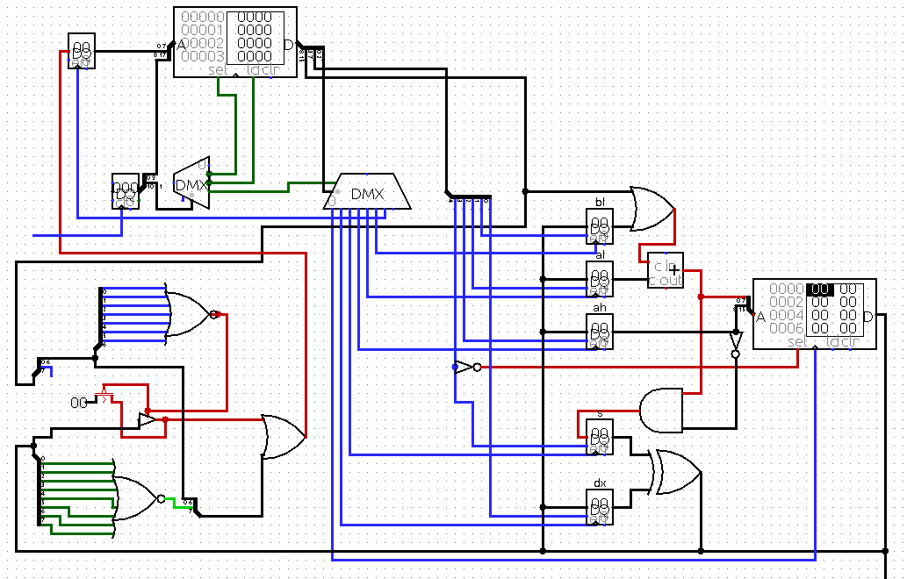

## Macine

Retrofuturistic computer from heaven that are enjoyable to program with. Created especially for those, who honor 512
bytes challenges and sector soft. Goal is to bootstrap this system at maximum scale, preferably up to real hardware.

## Highlights

* Harward architecture.
* 19 ms maximum latency
* 18 bit code address bus, 512k rom, 512 pages of 512 instructions
* 17 bit data address bus, 128k ram, 256 pages of 512 bytes
* 16 bit instruction
* 8 bit wide word
* 6 general purpose registers: AH, AL, BH, BL, SX, DX
* 5 Instructions: Load, Store, Jump, Set, Out
* 4 operations: Or, And, Xor, Sum
* 3 control register: CH, CF, CL
* 2 conditionals: Zero, Carry
* 1 cycle per instruction
* Zero tolerance to boring stuff
* High speed data output port

## Structure

Instruction pointer combined from 3 registers, 18 bit total

|          CH           |         CF          |              CL               |
|:---------------------:|:-------------------:|:-----------------------------:|
|           8           |         1           |               9               |
| code page (code high) |     carry/flag      |   code counter (code low)     |
|  can be __set__ only  | can be __set__ only | can be __reset__ to zero only |
|                       |                     |            CD4040             |



Logisim of rev1 available, they are not up to date, but overall structure stands.

## Instruction

|  D S T  | S/RAM | BH/AH |  AL   |  BL   |  DX  |  C O N S T A N T  |
|:-------:|:-----:|:-----:|:-----:|:-----:|:----:|:-----------------:|
|    3    |   1   |   1   |   1   |   1   |  1   |         8         |

Destination can be Register (AH, AL, BL, DX), or Special:

* S, combination of SX/CF
* PC, combination of CH/CL
* OUT, Other registers, including BH, CH
* RAM, write to ram

__S/RAM__ Selects mode of operation, denoted by source, either RAM or ALU.

`` VAL = (CONST | (AL ? (al+cf):0)) + BL``

| dst          | s                                  | ram                             |
|--------------|------------------------------------|---------------------------------|
| AH/AL/BL/DX  | DX ^ (s = ( AH & VAL))             | DX &#124; RAM[ AH/BH : VAL]     |
| pc           | if dx; cf=carry; s = ( AH & VAL))  | DX=SX &#124; RAM[ AH/BH : VAL]  |
| outc[AHBLDX] | out=const &#124; al?; s preserved  | [3]=dx &#124; RAM[ AH/BH : VAL] |
| outd[AHBLAL] | out= sx ^ dx ~~^ sx=&#124; const~~ | [7]=dx &#124; RAM[ AH/BH : VAL] |
| ram          | RAM[ AH/BH : VAL] = sx ^ dx        | RAM[ AH/BH : VAL] = 0           |

TODO zero test, bind to ah or dx?

### Register

### Write to ram

### High speed output

RAM mode destination only 7=video

* 0 = SX
* 1 = BH // with cl reset?
* 2 = CF = bus == zero ?
* 3 = CH
* 4 = CH with CL reset

* //4 = audio
* 5 = SPI addr
* 6 = SPI data
* 7 = video

## Timing

CD4040 is main clock source. it is divided in two parts, 9 bit as code counter 
that can be only reset, and 4-stage timing generator.
1. address ready
2. instruction
3. bus ready, ram address ready
4. write

Secondary clock source is based on crystal 32.768 kHz, if interrupts enabled, 
PC (CH CF CL) will be reset 32768 times per second

## Code Time!

32 bit addition macro

```
(times -4 (asm
    ! al= [ $ ]
    ! bl= [ (+ $ 4) ]
    ! cf=s= al bl ; save carry to CF, value to S
    ![ $ ]= s
))
```

## Bill of material

| name     | count | package | description                  | usage                                 |
|----------|-------|---------|------------------------------|---------------------------------------|
| 74HC541  | 1     |         | tri-state buffer/line driver | BUS= xor OR ram                       |
| 74HC4040 | 1     | DIP-16  | 12 bit counter               | CL, cycle driver                      |
| 74HC574  | 7     | DIP-20  | octal d-flip flop            | AH, BH, AL, BL, SX, DX, CH            |
| 74HC283  | 2     | DIP-16  | 4 bit adder with carry       | BL + or                               |
| 74HC86   | 2     | DIP-14  | 4 bit XOR                    | dx XOR sx                             |
| 74       | 1     |         | 3-to-8 demultipexer          | destination/instruction decoder       |
| 74       | 1     |         | 2-to-4 dual DMX              | cycle decoder, special output decoder | 
| 74       | 1     |         | dual  d-flip flop            | CF, NMI                               |
| 32       | 2     |         | 8 megabit PROM               | Code storage                          |
| 32       | 1     |         | 1 megabit static ram         | Main ram                              |
1
trying to fit 20 ICs to compete in [MyNOR](http://mynor.org/) challenge 
